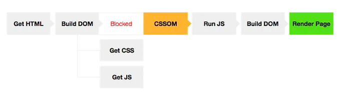

Date: 21 Oct 2023
Title: Critical Rendering Path
Desc:
-The Critical Rendering Path is the sequence of steps the browser goes through to convert HTML,CSS and JavaScript into pixwls on the screen. Optimizing the critical render path improves render performance. The critical rendering path includes the Document Object Model(DOM), CSS Object MOdel (CSSOM), render tree and layout/

- AA request for a web page or app starts with an HTML Request. The server returns the HTML- response headers and data. The browser then begins parsing the HTML, converting the recieved bytes to the DOM tree. The browser initiates requests every time it findslinks to external resources, be it stylesheets, scripts or embedded image references. Some requests are blocking, which means the parsing of the rest of the HTML is halted until the imported asset is handles. The browser continues to parse the HTML making requests and building the DOM, untill it gets to the end, at which point it constructs the CSS object model. With the DOM and CSSOM complete, the browser builds the the render tree, computing the styles for all the visible content. After the render tree is complete, layout occurs, defininf the location and size o all the render tree elements. Once complete the page is rendered or painted on the screen.

- Render Tree
The render tree captures both the content and the styles: the DOM and the CSSOM tree are combined into the render tree. To construct the render tree, the browser checks every node, starting from root of the DOM tree, and determines which CSS rules are attached. The render tree ONLY captures visible content.

- Layout
The layout step determines where and how the elements are positioned on the page, determining the width and height of each element, and where ther are in relation to each other.
Layout performance is impacted by the DOM - the greater the number of nodes, the longer layout takes. Layout can becoma a bottlenexk, leading to jank if required during scrolling or other animations. While a 20ms delay on load or orientation chane may be fine, it will lead to jank on animation or scroll. Any time the render tree is modified, such as by added nodes, altered content, or updated box model stlyles ona not, layout occurs. 
To reduce the frequency and duration of layout events, batch updates and avoid animating box model properties.

- Paint
The last step is painting the pixels to the screen, Once the render tree is created and layout occurs, the pixels can be painted to the screen. On load, the entire screen is painted. After that, only impacted areas of screen will be repainted, as browsers are optimised to repaint the minimum area req. Paint time depends on what kind of updates are being applied to render tree.

- How does the browser rendering engine work?
In order to render content the browser has to go through a series of steps:
1. Document Object Model(DOM)
2. CSS object model(CSSOM)
3. Render Tree
4. Layout
5. Paint.

1. Document Object Model
To process a html file and get to the document object model event(DOM) the browser has to go through 4 steps:
1. Convert bytes to characters
2. Identify tokens
3. Convert tokens to nodes
4. Build DOM Tree
This entire process can take some time, specially if there is a large amount of HTML to process. This means that the initial file size of your DOM tree will have a performance cost.

2. CSS Object Model
Just as with HTML, the CSS rules need to be converted into something that the browser understands, so these rules go through the same steps as the document object model.
1. Convert bytes to characters
2. Identify tokens
3. Convert tokens to nodes
4. Build CSSOM

CSS is one of the most important elements of the critical rendering path, because the browser blocks page rendering until it receives and processes all the css files in your page, CSS is render blocking

3. The Render Tree
This stage is where the browser combines the DOM and CSSOM, this process outputs a final render tree, which contains both the content and the style information of all the visible content on the screen.

4. Layout
This stage is where the browser calculates the size and position of each visible element on the page, every time an update to the render tree is made, or the size of the viewport changes, the browser has to run layout again.

5. Paint
When we get to the paint stage, the browser has to pick up the layout result, and paint the pixels to the screen, beware in this stage that not all styles have the same paint times, also combinations of styles can have a greater paint time than the sum of their parts. For an instance mixing a border-radius with a box-shadow, can triple the paint time of an element instead of using just one of the latter.

- Dealing with Javascript
Javascript is a powerful tool that can manipulate both the DOM and CSSOM, so to execute Javascript, the browser has to wait for the DOM, then it has to download and parse all the CSS files, get to the CSSOM event and only then finally execute Javascript.
When the parser finds a script tag it blocks DOM construction, then waits for the browser to get the file and for the javascript engine to parse the script, this is why Javascript is parser blocking.

There are only two cases when Javascript does not block on CSSOM:
1. Inlined scripts above the css files ‘<link>’ in the ‘<head>’;
2. Async scripts.
Make all Javascript async
Async scripts don’t block DOM construction and don’t have the need to wait for the CSSOM event, this way your critical rendering path stays free from Javascript interference. This is a crucial part of optimising for the critical rendering path.

- Optimizing the critical rendering path
By now we can conclude that in order to render a page as fast as possible, we need to be aware of: html file size, CSS delivery and taking Javascript out of the rendering path by making all scripts async.
Understanding the critical rendering path
Let’s say that we have a page that has one CSS and one javascript file and that we’ve made all javascript async taking it out of the rendering path equation.

- In this example we have two critical resources, the html and the css file, which make for a total size of 46kb in our critical path, we also need 2 requests in order to get everything we need to render the page (the 2 requests are the HTML and CSS, the Javascript file is marked as async so it is out of the rendering path equation).

- How would we optimize this?
First of all, we need to make our critical assets as small as possible by minifying and compressing both the html and css. We can further optimize this resources by making use of html and css obfuscation. Obfuscation is the process of going through all of your class names in both the html and css, and converting something like ‘.header__nav — fixed’ into ‘.a_123’ which can help you squeeze some more bytes out of your rendering path.

- Next step: optimising css delivery
With our resources optimized we need to get them to the client as fast as possible. A good strategy is to inline our css, so that we can get it to the client with the first html request, allowing the browser to get to the CSSOM event with only one request.
But in this case our first request would get a little too big with 46kb. The page could still render faster but in some cases a big initial request can make things worse.
This can be tricky specially when dealing with responsive websites (should we inline responsive grids?, should we inline for mobile and desktop? Always test it first!)
A good strategy is to inline only the css for the header and the main module of the page, and downloading the remaining css async. You can hide the unstyled content of the page, while the client waits for the reamining CSS, this is made to avoid the flash of unstyled content.

- Achieving the 1s render
So let’s say that we’ve done all the optimizations mentioned above, will our page render in one second?
…the server can send up to 10 TCP packets on a new connection (~14KB) in first roundtrip, and then it must wait for the client to acknowledge this data before it can grow its congestion window and proceed to deliver more data.
Due to this TCP behavior, it is important to optimize your content to minimize the number of roundtrips required to deliver the necessary data to perform the first render of the page. Ideally, the ATF (above the fold) content should fit under 14KB — this allows the browser to paint the page after just one roundtrip…

In order to make our page render in 1s we need to make our critical html and css fit in approximately 14kb. If we follow the logic mentioned above, this would be the header and the main module of the page.

After achieving the 14kb goal, we need to render the content, but the process of parsing the HTML, CSS, and executing Javascript takes time and resources, in a 3g connection we have ~600ms of 3g networking overhead (4g networks can reduce this overhead), then we need to wait for the server response, which can be ~200ms and then we are left with 200ms to parse the html and css, so it really helps to keep things simple(this is one of the advantages of design principles such as flat design and mobile first).

Optimizing for CRP
Improve page load speed by prioritizing which resources get loaded, controlling the order in which they are loaded, and reducing the file sizes of those resources. Performance tips include 1) minimizing the number of critical resources by deferring non-critical ones' download, marking them as async, or eliminating them altogether, 2) optimizing the number of requests required along with the file size of each request, and 3) optimizing the order in which critical resources are loaded by prioritizing the downloading of critical assets, thereby shortening the critical path length.