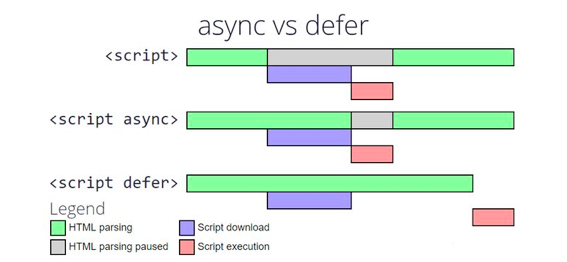

Date: 22 Oct 2023
Title: Async VS Defer Script Loading in Javascript
Desc:
- How does script loading happen in our webpage?
A html file as soon as it gets the script ag, it starts to download and execute the js file. This will interrupt the html parsing causing an initial delay in html rendering and eventually time to load.
Async tag will start to download the js file parallely to html rendering but it blocks rendering after it is downloaded so blocking time is just the time it requires for executing and not downloading.

- What happens when you add a async attribute
1. Make parallel requests to fetch the files.
2. Continue parsing the docuemnt as if it was never interrupted.
3. Execute the individual script the moment the files are downloaded.

- Defer tab will parallely download the js file and will execute it once the html rendering is done. So no delay in html rendering.

- What happens when you add defer attribute
1. Make parallel requests to fetch the individual files.
2. Continue parsing the docuemnt as if it was never interrupted.
3. Finishing parsing the docuemnt even if the script files have downloaded.
4. Execute each script in the order they were encountered in the document.

- When to use defer and async attributes on the <script> tag?
Defer attribute: It will guarantee that all scripts will execute after the HTML parsing. The defer attribte is useful when the script is used for DOM manipulations.
async attribute: It does not guarantee that all scripts will execute after the HTML parsing. The async atrribute is usefull when the script is used for the DOM manipulation (google ads link)

- Which is the best place to place script tag in file?
Async tag will always be independeing so adding to head also wont make it much efficient.
Defer: Conventionally all tags are kept in body but keeing the script tag in head with defer will help a lot as during rendering, the js file will be downloaded parallely and on completion of rendering js execution will start immediately (we dont have to wait for js download again when rendering ends) This is kind of prefetching assets.

- The async and defer attributes both allow the browser to continue parsing the HTML document while JavaScript files are being downloaded, but they differ in when those files are executed.

Async downloads and executes JavaScript as soon as it’s available, while defer attribute waits until the HTML document has been parsed before downloading and executing any external scripts.

In most cases, it doesn’t matter which attribute you use – both will improve performance by allowing the browser to continue parsing while waiting for JavaScript to download. However, there are some situations where one attribute may be preferable to the other.

- Advantages of using the defer attribute

There are several advantages to using the defer attribute in your script tags:

Deferred scripts are guaranteed to run after the page has been loaded and parsed, so they can’t slow down the initial page load.

Since deferred scripts are not parsed until after the page has loaded, they can’t block the parsing of other elements on the page (such as images).

Deferred scripts can be updated independently of the rest of the page, which means that if you change a deferred script, you don’t have to re-parse and re-render the entire page.

- Disadvantages of using the defer attribute

One is that it can potentially delay your page from loading. If you have a lot of scripts that use defer, they could all be trying to load at the same time and slow down your page.

Another disadvantage is that older browsers might not support defer, so your scripts might not load at all for some users.

- Advantages of using the async attribute

When loading a large JavaScript file, using the async attribute can be beneficial. It tells the browser that it can go ahead and continue parsing the HTML document while the JavaScript file is being downloaded. This can reduce the perceived load time of the page because the browser can start to render elements sooner.

Disadvantages of using the async attribute

One of the biggest disadvantages of using async is that it can break the render-blocking CSS rule. This rule is important for ensuring that the page loads correctly and doesn’t appear blank while the JavaScript file is loading. If async is used, the CSS file will be downloaded as soon as the JavaScript file starts loading, which can cause problems if the JavaScript file is large or takes a long time to load.

Another disadvantage of async is that it can delay the loading of other resources on the page, such as images. This can cause a significant delay in the overall loading time of the page.

Finally, async can also cause issues with certain types of user scripts and extensions. These user scripts and extensions rely on being able to modify the DOM after the page has loaded, but if async is used they may not be able to do this because the DOM might not have already loaded by the time they run.
