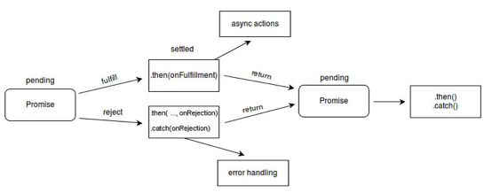

Date: 25 Oct 2023
Title: Promises
Desc:
- What is a promise?
The Promise object represents the eventual completion(or failure) of an asynchronous operation and its resulting value.

- A promise is a proxy for a value not necessarily known when the promise is created. It allows you to associate handlers with an asynchronous action's eventual success value or failure reason. This lets asynchronous methods return values like synchronous methods: instead of immediately returning the final value, the asynchronous method returns a promise to spplu the value at some point in the future.

- A Promise is in one of these states:
pending: initial state, neither fulfilled or rejected.
fulfilled: meaning the operation was completed successfully.
rejected: meaning that operation failed.

- Chained Promises
1. .then method takes 2 arguments, a callback which gets run when promise is fulfilled and second is the error callback which gets executed when it gets rejected. Although the second one is optional and if not passed it goes to the next .catch to catch the error.
2. .catch is usedfor error handling and it takes control when any error is thrown 
3. .finally is the final statement and executes regardless of the code flowing into .then or .catch. It will always run.


- Constructor
Promise():  The constructor is primarily used to wrap functions that do not already support promises.




- .then()
The .then() method takes up to two arguments; the first argument is a callback function for the fulfilled case of the promise, and the second argument is a callback function for the rejected case. Each .then() returns a newly generated promise object

```const myPromise = new Promise((resolve, reject) => {
  setTimeout(() => {
    resolve("foo");
  }, 300);
});

myPromise
  .then(handleFulfilledA, handleRejectedA)
  .then(handleFulfilledB, handleRejectedB)
  .then(handleFulfilledC, handleRejectedC);
```

- Processing continues to the next link of the chain even when a .then() lacks a callback function. Therefore, a chain can safely omit every rejection callback function until the final .catch().

Handling a rejected promise in each .then() has consequences further down the promise chain. Sometimes there is no choice, because an error must be handled immediately. In such cases we must throw an error of some type to maintain error state down the chain. On the other hand, in the absence of an immediate need, it is simpler to leave out error handling until a final .catch() statement. A .catch() is really just a .then() without a slot for a callback function for the case when the promise is fulfilled.

```myPromise
  .then(handleFulfilledA)
  .then(handleFulfilledB)
  .then(handleFulfilledC)
  .catch(handleRejectedAny);
```

- Using arrow functions for the callback functions, implementation of the promise chain might look something like this:
```myPromise
  .then((value) => `${value} and bar`)
  .then((value) => `${value} and bar again`)
  .then((value) => `${value} and again`)
  .then((value) => `${value} and again`)
  .then((value) => {
    console.log(value);
  })
  .catch((err) => {
    console.error(err);
  });
```

- The promises of a chain are nested in one another, but get popped like the top of a stack. The first promise in the chain is most deeply nested and is the first to pop.
(promise D, (promise C, (promise B, (promise A) ) ) )

- When a nextValue is a promise, the effect is a dynamic replacement. The return causes a promise to be popped, but the nextValue promise is pushed into its place. For the nesting shown above, suppose the .then() associated with "promise B" returns a nextValue of "promise X". The resulting nesting would look like this:
(promise D, (promise C, (promise X) ) )

- A promise can participate in more than one nesting. For the following code, the transition of promiseA into a "settled" state will cause both instances of .then() to be invoked.

```const promiseA = new Promise(myExecutorFunc);
const promiseB = promiseA.then(handleFulfilled1, handleRejected1);
const promiseC = promiseA.then(handleFulfilled2, handleRejected2);
```

- An action can be assigned to an already "settled" promise. In that case, the action (if appropriate) will be performed at the first asynchronous opportunity. Note that promises are guaranteed to be asynchronous. Therefore, an action for an already "settled" promise will occur only after the stack has cleared and a clock-tick has passed. The effect is much like that of setTimeout(action, 0).

```const promiseA = new Promise((resolve, reject) => {
  resolve(777);
});
// At this point, "promiseA" is already settled.
promiseA.then((val) => console.log("asynchronous logging has val:", val));
console.log("immediate logging");

// produces output in this order:
// immediate logging
// asynchronous logging has val: 777
```

Thenables
The JavaScript ecosystem had made multiple Promise implementations long before it became part of the language. Despite being represented differently internally, at the minimum, all Promise-like objects implement the Thenable interface. A thenable implements the .then() method, which is called with two callbacks: one for when the promise is fulfilled, one for when it's rejected. Promises are thenables as well.

To interoperate with the existing Promise implementations, the language allows using thenables in place of promises.For example, Promise.resolve will not only resolve promises, but also trace thenables.

```const aThenable = {
  then(onFulfilled, onRejected) {
    onFulfilled({
      // The thenable is fulfilled with another thenable
      then(onFulfilled, onRejected) {
        onFulfilled(42);
      },
    });
  },
};

Promise.resolve(aThenable); // A promise fulfilled with 42
```


- Promise concurrency
The Promise class offers four static methods to facilitate async task concurrency:

Promise.all()
Fulfills when all of the promises fulfill; rejects when any of the promises rejects.

Promise.allSettled()
Fulfills when all promises settle.

Promise.any()
Fulfills when any of the promises fulfills; rejects when all of the promises reject.

Promise.race()
Settles when any of the promises settles. In other words, fulfills when any of the promises fulfills; rejects when any of the promises rejects.

- All these methods take an iterable of promises (thenables, to be exact) and return a new promise. They all support subclassing, which means they can be called on subclasses of Promise, and the result will be a promise of the subclass type. To do so, the subclass's constructor must implement the same signature as the Promise() constructor — accepting a single executor function that can be called with the resolve and reject callbacks as parameters. The subclass must also have a resolve static method that can be called like Promise.resolve() to resolve values to promises.

- Note that JavaScript is single-threaded by nature, so at a given instant, only one task will be executing, although control can shift between different promises, making execution of the promises appear concurrent. Parallel execution in JavaScript can only be achieved through worker threads.